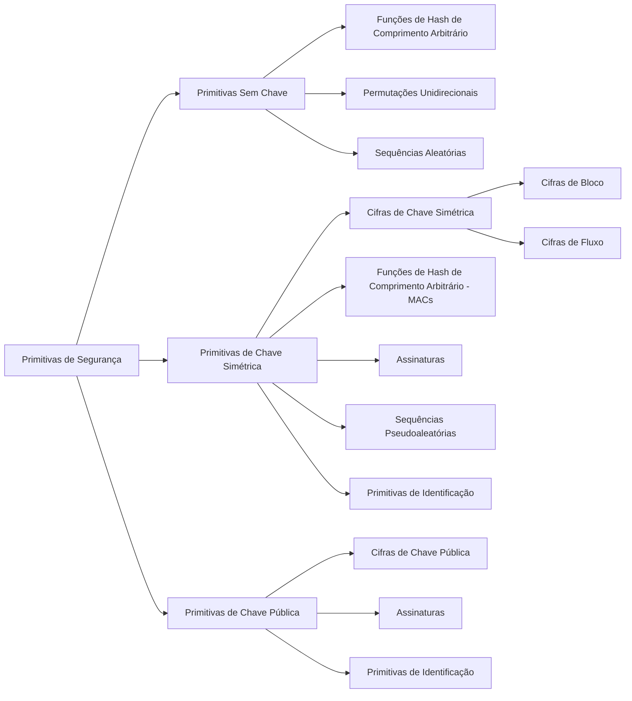

# Criptografia

## Diagrama de Primitivas Criptográficas 

```mermaid
---
config:
  layout: dagre
  theme: mc
  look: classic
---
graph LR
    A["Primitivas de Segurança"] --> B["Primitivas Sem Chave"]
    A --> C["Primitivas de Chave Simétrica"]
    A --> D["Primitivas de Chave Pública"]

    B --> B1["Funções de Hash de Comprimento Arbitrário"]
    B --> B2["Permutações Unidirecionais"]
    B --> B3["Sequências Aleatórias"]

    C --> C1["Cifras de Chave Simétrica"]
    C1 --> C1a["Cifras de Bloco"]
    C1 --> C1b["Cifras de Fluxo"]
    C --> C2["Funções de Hash de Comprimento Arbitrário - MACs"]
    C --> C3["Assinaturas"]
    C --> C4["Sequências Pseudoaleatórias"]
    C --> C5["Primitivas de Identificação"]

    D --> D1["Cifras de Chave Pública"]
    D --> D2["Assinaturas"]
    D --> D3["Primitivas de Identificação"]

```